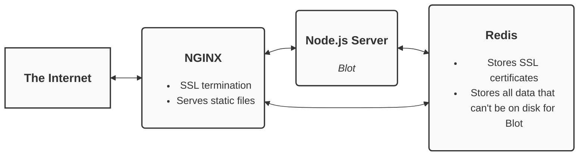

# Blot

A blogging platform with no interface. Blot turns a folder into a blog. The point of all this — the reason Blot exists — is so you can use your favorite tools to create whatever you publish.

I recommend waiting until I write a guide before attempting to run Blot on your own server. Eventually I will refactor the code such that Blot can be installed quickly and simply. I will write the neccessary documentation and sell Blot at a reasonable price to self-hosters, with an option to pay more for support. 

Please don’t hesitate to contact me with any questions: [support@blot.im](mailto:support@blot.im)

## Overview

Here is an illustration of Blot's structure:



The Node.js server (Blot) itself is responsible for a small crew of child processes which handle things like image minification and document conversion. 

## Inside this folder

```
/
├── app/
│	the code for the node.js application which is Blot 
├── config/
│	configation for the system utilities which keep redis, NGINX and the node.js processes up
├── scripts/
│	scripts which help the server administrator
├── tests/
│	integration tests and test configuration for blot
├── todo.txt
│	Blot's to-do list
```
