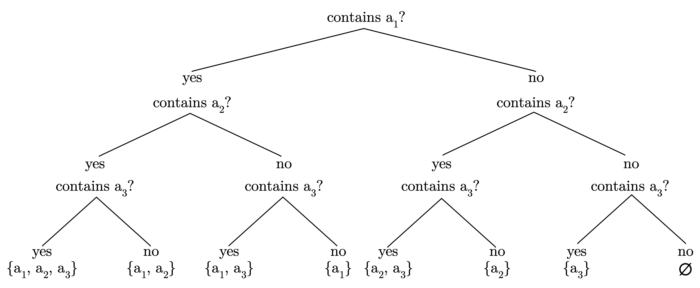

Tags: Math

# Cardinality

Before we start to talk about sizes and products, let's first introduce a new notion: **sequence**. A sequence is simply a series of elements. Unlike sets, sequences have order and may contain duplicate values. Sequences are denoted with round brackets. For example, a sequence of prime numbers in ascending order is:

{>|} In this sense sequences are more down to earth, practical collections. 

$$
(2, 3, 5, 7, 11, ...)
$$

Note that it is an infinite sequence. An example of a finite sequence is a sequence of natural even numbers smaller than 10:

$$
(1, 2, 3, 4, 5, 6, 7, 8, 9)
$$

If $$A$$ is a finite set (that is, $$A$$ is not infinite, and we can count how many elements there are in it), we use $$|A|$$ to denote the number of elements of $$A$$. This is the **cardinality**. For example:

$$|\{4, 8, 15, 16, 23, 42\}| = 6$$

$$|\varnothing| = 0$$

$$|\{\{ a, e \}\} | = 1$$

Note the last example: it defines a set which contains one set, thus its cardinality is 1. The number of elements of the internal set is irrelevant. Programmers find this obvious, as it reminds them of nested data structures like arrays of arrays. Knowing about sets, subsets and cardinalities, let's look at a statement and prove it.

Statement 1: If $$A$$ is a finite set of $$m$$ elements, then there are $$2^{m}$$ subsets of $$A$$.

Proof: Suppose $$A = \{a_{1}, a_{2}, ..., a_{m}\}$$ and $$\mathcal{P}A$$ is the set of all subsets of $$A$$.  Then we can divide $$\mathcal{P}A$$ into $$2=2^{1}$$ collections: subsets of $$A$$ which contain $$a_{1}$$ and those which don't. Considering the next element $$a_{2}$$,  we get $$2^{2}$$ collections:

1. one which contains both $$a_{1}$$ and $$a_{2}$$, 
2. one which contains $$a_{1}$$,  but not $$a_{2}$$, 
2. one which contains $$a_{2}$$,  but not $$a_{1}$$, 
2. one which contains neither $$a_{1}$$ nor $$a_{2}$$. 

Continuing this way, we see that there are $$2^{m}$$ subsets of $$A$$, each subset is determined by the fact of whether or not each $$a_{j}$$ is included, as $$j$$ goes from $$1$$ to $$m$$. This sort of counting by inclusion and exclusion is a popular technique in math and especially in computer science. One can visualize such proof for a particular case by drawing a "binary decision tree".

Consider set $$A = \{a_{1}, a_{2}, a_{3}\}$$.  The proof states that there are $$2^{3} = 8$$ subsets of $$A$$.  To describe each imaginable set we need to determine whether each element is in it or not. Starting from $$a_{1}$$,  we need to answer "yes" or "no", and proceed to ask the same question for $$a_{2}$$ and then for $$a_{3}$$. 

{<>} 
