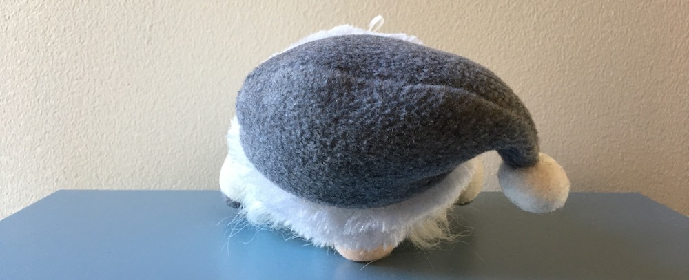
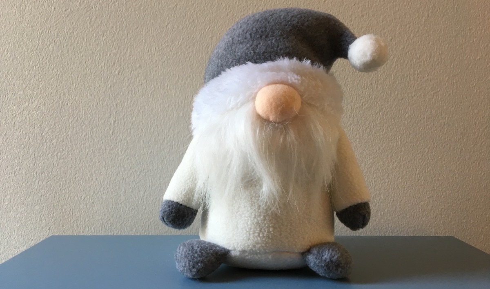

# Process of learning

A process of learning is analogous to an attempt of building a three-dimensional model from two-dimensional photos.

You approach a new area of knowledge. You know nothing at all. You stumble upon a first piece:

{<>} 

That's more than nothing, but still very little. You don't understand it. At best, you're able to make a few uncertain assumptions.

Beginners often seek good book recommendations. They would google a top-10 list and then ask "which one should I start with?". The answer is almost always "it doesn't matter". Start with _any_ non-shitty book. One book alone would not provide enough data to build a good model anyway. If you want to really understand something, you'll have to read several books, listen to different people, try various approaches. 

{|<} "What is harmful" is a topic for another discussion, and I by no means argue that finding non-harmful books is an easy task. In fact, I'd call many popular programming books harmful, especially when it comes to teaching the basics of programming with Java. So, at least minimize the potential harm by not focusing on a single book.

Nobody knows what's going to work best for a particular person. Each model building machine is unique. The starting order of feeding it data is not very important, unless that information is truly harmful.

Another basic book will provide a different view:

You still can't understand it. But keep going, and at some point you'll arrive at a single complete picture.

This tells you more than before, you can even make some conclusions or reason about certain aspects of the object. But you don't have a complete model yet, one 2D picture is not enough. Your brain haven't met such objects in the past, there's nothing to cling on to. This is why it's essential to have various sources of information: other books, people, lessons, different mediums.

New pieces keep emerging, and it's disconcerting. They don't seem to make any sense, this puzzle feels broken.

{<>} 

This is the toughest stage of the learning journey. Often, any hope is lost. Disconnected pieces provoke the feeling of meaninglessness. You can't see the big picture.

> I think I understand each individual topic, but have no idea how they are connected. And why did I learn all that. Nothing makes sense...

But if you keep going, soon you'll get to another full picture:

Interesting! A completely different point of view. Same object, new aspects. A complete 3D model is still impossible to deduce, but there's more space for assumptions. Having multiple pictures increases the chances of seeing _something_ familiar. It's a new topic alright, but topics are rarely completely isolated from the universe.

A few more pictures and you get a pretty accurate model.

{<>} 

The first picture was extremely valuable, but each new picture brings less and less valuable data. At some point you have a decent model in your head, so that new pictures don't give you anything new.

This analogy helps me learn new things. I try to remember the following:

1.  At first, everything is interesting and easy. The first picture gives a lot of data at once. This is the pleasant stage.
2.  In the middle motivation will decrease. That's okay. Keep getting data and trust the system.
3.  Do not focus on a single picture. Maybe, in order to understand it you need another picture first.
4.  At some point, notice the diminishing returns of new data. Consider increasing the area of study.
