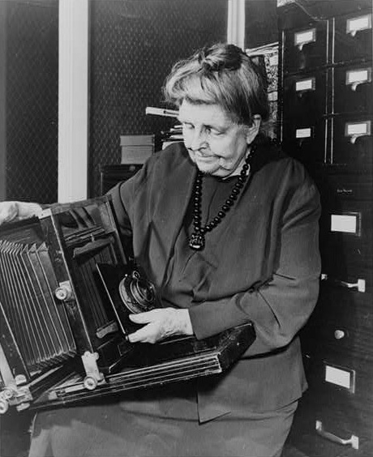

# About

Frances Benjamin Johnston (January 15, 1864 – May 16, 1952) was an early American photographer and photojournalist whose career lasted for almost half a century. She is most known for her portraits, images of southern architecture, and various photographic series featuring African Americans and Native Americans at the turn of the 20th century.

May the beauty captured in these historical magic lantern slides inspire you with new gardening ideas. Or, make you wonder how these places look today. (Please post pictures of what you find in the comments!)

House and garden historian Sam Watters took on the challenge of breathing life back into these amazing photos. He spent five years digging for information in libraries and archives throughout the country, poring through illustrated garden magazines of the day, and reading all of Johnston’s extensive personal papers. He figured out not only what the photos show but why they were made and where they fit in our cultural and photographic history.

The result? A “sumptuous and scholarly” new book provides an invaluable guide to an important era in garden development--Gardens for a Beautiful America, 1895-1935: Photographs by Frances Benjamin Johnston, (published by Acanthus Press in collaboration with the Library of Congress in 2012). Going beyond the images reproduced in the book, Watters also tracked down house names, locations, dates, and histories for just about every image in the whole collection.

Who made these photos? The noted American photographer Frances Benjamin Johnston (1864-1952) was a dedicated advocate of the garden beautiful movement in the early 1900s. Guided by her formal training as a fine artist, Johnston had more than 1,130 of her black-and-white photographs reproduced as lantern slides. These hand-colored miniatures on glass illustrated her popular lectures for garden club members, museum audiences, and horticultural societies from 1915 until the 1930s.

What’s a lantern slide? It’s a small glass transparency, typically 3.25 x 4 inches, designed for use in a projector that casts an enlarged image on a wall or screen. Hand coloring can be applied to the emulsion side of the photographic image, and a cover glass is added to protect the delicate surface. An opaque paper mask is placed between the two glass sheets to frame the scene. A paper strip binds the edges of the glass sheets together. The mask and strip are often black, as you’ll see in this set.

What subjects are covered? The first release of images for this set emphasizes the California gardens that Johnston photographed in 1917. Look closely, though. In addition to the grand estates that resemble Hollywood movie sets, you’ll also find plantings and designs adaptable to any space. The views of backyard and window box gardens in Manhattan reflect Johnston’s commitment to beautifying city life, too. As Johnston wrote in 1922, “There is more to photography than just taking pictures!”

You can view all the slides in the Prints & Photographs Online Catalog at the Library of Congress. An essay, Lantern Slides for Garden & Historic House Lectures, explains more of the collection’s background.

Learn more

- Biographical Overview and Chronology of Frances Benjamin Johnston’s amazing life

- Johnston Collection in the Prints & Photographs & Photographs Online Catalog—with 2,500 photos digitized from throughout her career

- Magic Lantern Society (UK) posts pictures of projection equipment and slides from many eras, www.magiclantern.org.uk/lanternhistory.html

- Magic Lantern Society of the US and Canada hosts links to many publications and websites related to lantern slides, www.magiclanternsociety.org/related-links.html

- Tennant, John A. “Lantern Slides.” Photo-Miniature: A Monthly Magazine of Photographic Information 1 (December 1899): 427-479. Online at: hdl.loc.gov/loc.gdc/scd0001.20101222001la.2

- Watters, Sam. Gardens for a Beautiful America, 1895-1935: Photographs by Frances Benjamin Johnston, New York: Acanthus Press in collaboration with the Library of Congress, 2012. 377 p.

Done up to page 3:
https://www.flickr.com/photos/library_of_congress/albums/72157629495236312/page3